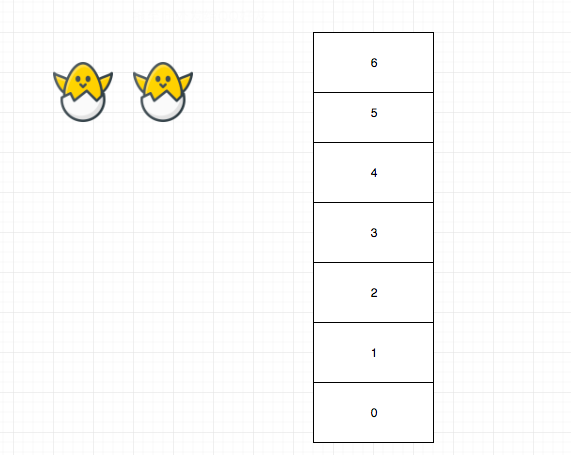
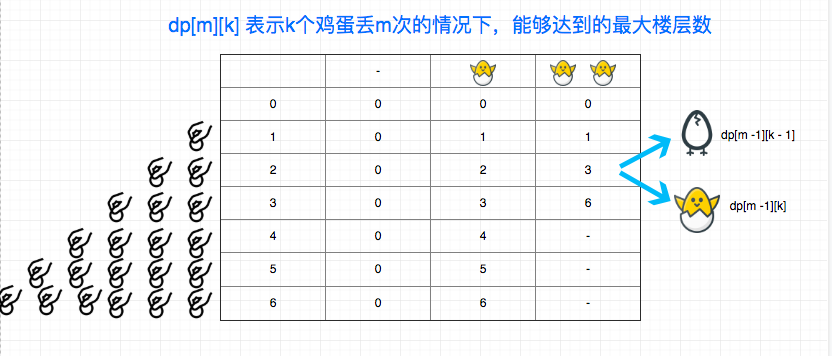

## 题目地址
https://leetcode.com/problems/super-egg-drop/description/

## 题目描述

```
You are given K eggs, and you have access to a building with N floors from 1 to N. 

Each egg is identical in function, and if an egg breaks, you cannot drop it again.

You know that there exists a floor F with 0 <= F <= N such that any egg dropped at a floor higher than F will break, and any egg dropped at or below floor F will not break.

Each move, you may take an egg (if you have an unbroken one) and drop it from any floor X (with 1 <= X <= N). 

Your goal is to know with certainty what the value of F is.

What is the minimum number of moves that you need to know with certainty what F is, regardless of the initial value of F?

 

Example 1:

Input: K = 1, N = 2
Output: 2
Explanation: 
Drop the egg from floor 1.  If it breaks, we know with certainty that F = 0.
Otherwise, drop the egg from floor 2.  If it breaks, we know with certainty that F = 1.
If it didn't break, then we know with certainty F = 2.
Hence, we needed 2 moves in the worst case to know what F is with certainty.
Example 2:

Input: K = 2, N = 6
Output: 3
Example 3:

Input: K = 3, N = 14
Output: 4
 

Note:

1 <= K <= 100
1 <= N <= 10000


```

## 前置知识

- 动态规划

## 思路

这是一道典型的动态规划题目，但是又和一般的动态规划不一样。

拿题目给的例子为例，两个鸡蛋，六层楼，我们最少扔几次？



一个符合直觉的做法是，建立dp[i][j], 代表i个鸡蛋，j层楼最少扔几次，然后我们取dp[K][N]即可。

代码大概这样的：

```js
 const dp = Array(K + 1);
    dp[0] = Array(N + 1).fill(0);
    for (let i = 1; i < K + 1; i++) {
      dp[i] = [0];
      for (let j = 1; j < N + 1; j++) {
        // 只有一个鸡蛋
        if (i === 1) {
          dp[i][j] = j;
          continue;
        }
        // 只有一层楼
        if (j === 1) {
          dp[i][j] = 1;
          continue;
        }

        // 每一层我们都模拟一遍
        const all = [];
        for (let k = 1; k < j + 1; k++) {
          const brokenCount = dp[i - 1][k - 1]; // 如果碎了
          const notBrokenCount = dp[i][j - k]; // 如果没碎
          all.push(Math.max(brokenCount, notBrokenCount)); // 最坏的可能
        }
        dp[i][j] = Math.min(...all) + 1; // 最坏的集合中我们取最好的情况
      }
    }

    return dp[K][N];
```

果不其然，当我提交的时候，超时了。 这个的时复杂度是很高的，可以看到，我们内层暴力的求解所有可能，然后
取最好的，这个过程非常耗时，大概是O(N^2 * K).

然后我看了一位leetcode[网友](https://leetcode.com/lee215/)的回答,
他的想法是`dp[M][K]means that, given K eggs and M moves，what is the maximum number of floor that we can check.`

我们按照他的思路重新建模：



可以看到右下角的部分根本就不需要计算，从而节省很多时间
## 关键点解析

- dp建模思路要发生变化, 即
`dp[M][K]means that, given K eggs and M moves，what is the maximum number of floor that we can check.`


## 代码


```js
/**
 * @param {number} K
 * @param {number} N
 * @return {number}
 */
var superEggDrop = function(K, N) {
  // 不选择dp[K][M]的原因是dp[M][K]可以简化操作
  const dp = Array(N + 1).fill(0).map(_ => Array(K + 1).fill(0))
  
  let m = 0;
  while (dp[m][K] < N) {
      m++;
      for (let k = 1; k <= K; ++k)
          dp[m][k] = dp[m - 1][k - 1] + 1 + dp[m - 1][k];
  }
  return m;
};
```
